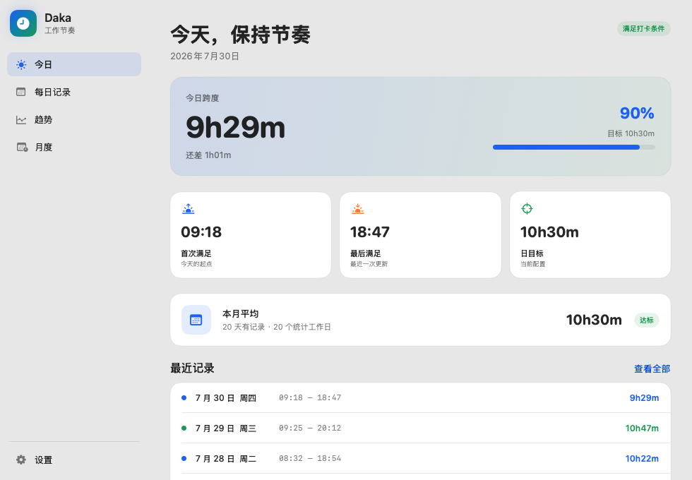
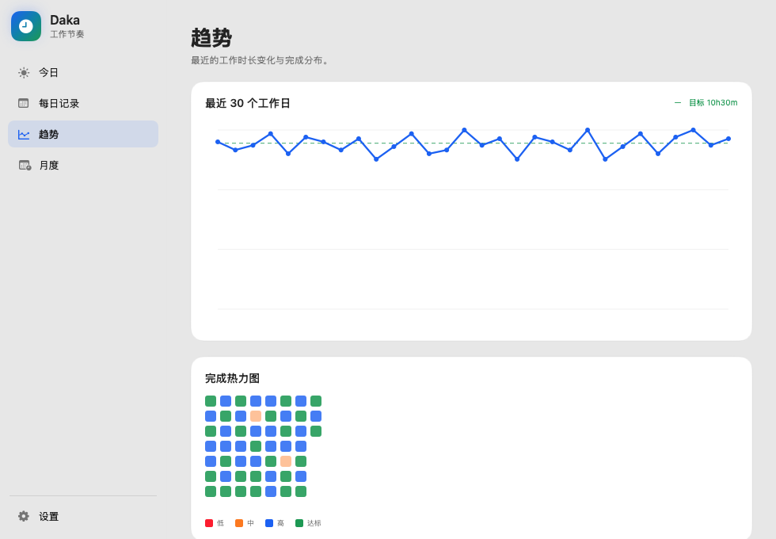
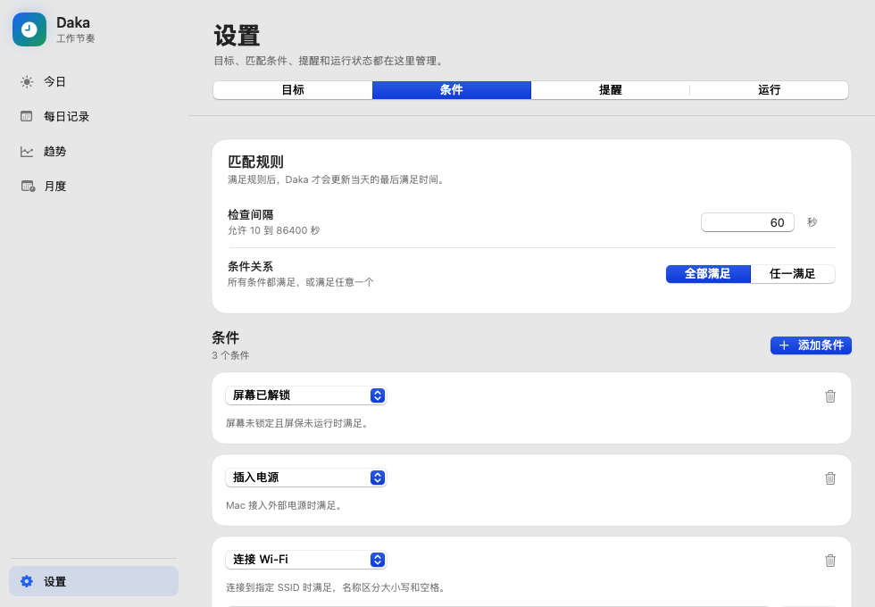

# Daka

Daka 是一个原生 macOS 菜单栏打卡时长记录工具。它根据可配置的规则，
记录每天第一次和最后一次满足条件的时间，并提供每日进度、记录管理、
趋势图、工作日热力图和月度统计。

当前版本：`0.3.0`

## 界面预览

### 今日概览



### 趋势与热力图



### 匹配条件设置



## 系统要求

- macOS 12 Monterey 或更高版本
- Apple Silicon 或 Intel Mac
- 使用 Homebrew 或源码安装时，需要安装 Xcode Command Line Tools

如未安装 Command Line Tools：

```bash
xcode-select --install
```

## 推荐安装：Homebrew

Formula 由公开的
[iBreaker/homebrew-daka](https://github.com/iBreaker/homebrew-daka) Tap
仓库提供。

首次安装并启动：

```bash
brew install iBreaker/daka/daka
brew services start iBreaker/daka/daka
```

查看安装信息和服务状态：

```bash
brew info iBreaker/daka/daka
brew services list | grep daka
```

打开 Daka 主界面或设置页：

```bash
daka --show
daka --show-settings
```

暂停、恢复或重启后台服务：

```bash
brew services stop iBreaker/daka/daka
brew services start iBreaker/daka/daka
brew services restart iBreaker/daka/daka
```

### 升级

```bash
brew update
brew upgrade iBreaker/daka/daka
brew services restart iBreaker/daka/daka
```

升级不会删除已有配置和打卡记录。

### 卸载

```bash
brew services stop iBreaker/daka/daka
brew uninstall iBreaker/daka/daka
```

卸载程序不会删除用户数据。数据仍保存在：

```text
~/Library/Application Support/Daka/
```

如果确认不再需要数据，可先在 Finder 中检查并手动删除：

```bash
open "$HOME/Library/Application Support/Daka"
```

## 从 GitHub Release 安装

从 [Releases](https://github.com/iBreaker/daka/releases) 下载最新的
`Daka-<version>-macos.zip`，解压后将 `Daka.app` 移动到
`~/Applications` 或 `/Applications`。

命令行示例：

```bash
mkdir -p "$HOME/Applications"
curl -L \
  -o "$HOME/Downloads/Daka-0.3.0-macos.zip" \
  "https://github.com/iBreaker/daka/releases/download/v0.3.0/Daka-0.3.0-macos.zip"
ditto -x -k \
  "$HOME/Downloads/Daka-0.3.0-macos.zip" \
  "$HOME/Applications"
open "$HOME/Applications/Daka.app"
```

Release 中的应用使用 ad-hoc 签名，因为项目目前没有 Developer ID
证书。首次打开时如被 macOS 拦截，请在 Finder 中右键
`Daka.app`，选择“打开”，再确认一次。

直接下载的 Release 应用不会自动注册登录启动。需要自动启动时，推荐
使用 Homebrew，或使用下面的源码安装脚本。

## 从源码安装

```bash
git clone https://github.com/iBreaker/daka.git
cd daka
./scripts/install-autostart.sh
```

脚本会：

1. 构建 release 版本的 `Daka.app`。
2. 安装到 `~/Applications/Daka.app`。
3. 注册 `local.daka.menu` LaunchAgent。
4. 立即启动，并在以后登录 macOS 时自动启动。

停止源码安装的登录启动项：

```bash
./scripts/uninstall-autostart.sh
```

这个脚本只移除 LaunchAgent，不会删除 `Daka.app`，也不会删除配置和
打卡记录。

单独构建应用但不安装：

```bash
./scripts/build-app.sh
```

指定输出路径：

```bash
./scripts/build-app.sh --output "$PWD/.build/Daka.app"
```

默认使用 ad-hoc 签名，不需要签名证书或钥匙串密码。发布维护者可以显式
指定 Developer ID：

```bash
DAKA_SIGN_IDENTITY="Developer ID Application: Example" \
  ./scripts/build-app.sh
```

> 不要同时运行 Homebrew service 和源码安装的 LaunchAgent。
> Daka 只允许一个实例运行，两套启动方式会互相冲突。

## 首次使用

1. 启动后，在 macOS 菜单栏找到 Daka 的时长和进度图标。
2. 点击“打开 Daka”进入主界面。
3. 在“设置 → 目标”配置每日、月均和每周目标。
4. 在“设置 → 条件”配置满足打卡条件的规则。
5. 如果使用 Wi-Fi 条件，按系统提示授予定位权限。
6. 当当天第一次满足条件时，确认已经完成实际打卡。

首次满足条件时，Daka 会显示确认提示：

- `已打卡`：写入今天的首次满足时间并开始记录。
- `稍后提醒`：暂不写入首次时间，10 分钟后再次提醒。

## 计时方式

Daka 记录的是每天第一次到最后一次满足规则的时间跨度：

```text
首次时间 = 当天确认打卡后第一次满足规则的时间
最后时间 = 当天最近一次满足规则的时间
今日跨度 = 最后时间 - 首次时间
```

Daka 不是活跃时长统计器。一天中间如果暂时不满足规则，这段间隔不会从
今日跨度中扣除。

暂停统计后，Daka 不再更新最后满足时间，恢复后继续按规则判断。

## 主界面

| 页面 | 功能 |
| --- | --- |
| 今日 | 今日跨度、完成率、剩余时长、首次/最后满足时间、本月平均、最近记录 |
| 每日记录 | 查看记录、编辑首次/最后时间、标记请假、恢复计入统计 |
| 趋势 | 最近工作日时长趋势、每日目标线、完成热力图 |
| 月度 | 自然月工作日数、有记录天数、总时长、日均时长、是否达标 |
| 设置 | 目标、匹配条件、提醒、权限、存储状态和运行控制 |

菜单栏提供以下操作：

| 操作 | 快捷键 | 说明 |
| --- | --- | --- |
| 确认今日已打卡 | `⌘D` | 首次满足条件后确认开始记录 |
| 打开 Daka | `⌘O` | 打开主界面 |
| 设置 | `⌘,` | 直接打开完整设置 |
| 添加请假日 | `⌘L` | 将指定日期排除在统计之外 |
| 暂停/恢复统计 | `⌘P` | 控制自动记录更新 |
| 退出 | `⌘Q` | 退出菜单栏应用 |

## 目标设置

在“设置 → 目标”中可以设置：

- 每日目标：今日进度条和达标状态的基准。
- 月均目标：月度平均时长的达标基准。
- 每周目标：休息日前提醒使用的累计目标。

时长以小时为单位，支持小数，例如 `10.5`。

## 匹配条件

在“设置 → 条件”中可以配置检查间隔和条件关系。

条件关系：

- `全部满足`：所有条件都满足时才记录。
- `任一满足`：任意一个条件满足时即记录。

支持的条件：

| 条件 | 参数 | 说明 |
| --- | --- | --- |
| 屏幕已解锁 | 无 | 屏幕未锁定且屏保未运行时满足 |
| 连接 Wi-Fi | SSID | 当前连接的 Wi-Fi 名称完全匹配时满足 |
| 插入电源 | 无 | Mac 使用外部电源时满足 |
| 网络可达 | 主机、端口 | 能建立 TCP 连接时满足 |
| 时间范围 | 开始、结束 | 当前时间在范围内时满足，支持跨午夜 |

Wi-Fi SSID 匹配区分大小写、空格和标点。可以点击“刷新”读取当前及附近
可见网络，也可以手动输入名称。

检查间隔必须是 `10` 到 `86400` 之间的整数秒。

## Wi-Fi 定位权限

macOS 需要定位权限才能向应用提供当前 Wi-Fi SSID。Daka 只在规则中
存在 Wi-Fi 条件时请求这个权限。

可以在以下位置查看状态：

```text
Daka → 设置 → 运行 → Wi-Fi 定位权限
```

如果显示“等待授权”或“需要授权”：

1. 点击“打开系统设置”。
2. 进入“隐私与安全性 → 定位服务”。
3. 允许 Daka 使用定位服务。
4. 返回 Daka，等待下一次检查或重启服务。

由于当前发行包采用 ad-hoc 签名，升级或重新构建后 macOS 可能再次要求
授权。在权限完成前，Wi-Fi 条件不会满足；仅看到进程正在运行不能证明
Wi-Fi 判断已经正常。

## 每日记录与请假

在“每日记录”中可以：

- 编辑某一天的首次和最后满足时间。
- 将某一天标记为请假，不计入月度和每周统计。
- 取消请假或排除状态，恢复计入统计。
- 为尚无记录的日期添加请假日。

编辑时间时，首次和最后时间必须属于记录日期，且最后时间不能早于首次
时间。

## 月度工作日统计

Daka 使用中国工作日历计算自然月统计。日历数据来自公开的
`holiday-calendar` CN 数据，并缓存到：

```text
~/Library/Application Support/Daka/ChinaCalendar/
```

月度计算规则：

- 只统计中国工作日。
- 标记为请假的日期从工作日分母中移除。
- 没有有效记录的工作日按 `0` 计入。
- 当前日期尚未结束，不计入当月平均值。
- 当年日历暂时无法获取时，先按周一到周五估算，并在界面标记为“估算”。

## 休息日前提醒

在“设置 → 提醒”中可以设置：

- 是否启用提醒。
- 最后一个工作日的提醒时间和文案。
- 最后一个工作日前一天的提醒时间和文案。
- 每周累计目标。

当本周累计时长未达到目标且休息日临近时，提醒会显示本周总时长、已过
工作日平均时长、周目标和剩余时长。每类提醒每天最多显示一次。

## 数据与隐私

Daka 没有远程账户，也不会把打卡记录上传到 Daka 服务。主要数据保存在
本机：

| 内容 | 路径 |
| --- | --- |
| SQLite 配置与记录 | `~/Library/Application Support/Daka/daka.sqlite` |
| 中国工作日历缓存 | `~/Library/Application Support/Daka/ChinaCalendar/` |
| 源码安装日志 | `~/Library/Logs/Daka/` |
| 源码安装 LaunchAgent | `~/Library/LaunchAgents/local.daka.menu.plist` |
| 暂停状态和提醒状态 | `~/Library/Preferences/local.daka.menu.plist` |

Daka 只会因以下功能访问网络：

- 下载并缓存公开的中国工作日历。
- 执行用户配置的“网络可达”条件。

旧版本的 `config.json` 和 `records.json` 会在首次打开 SQLite 数据库时
自动迁移。

### 备份数据

SQLite 的在线备份命令可以在 Daka 运行时安全执行：

```bash
mkdir -p "$HOME/Documents/Daka Backups"
sqlite3 \
  "$HOME/Library/Application Support/Daka/daka.sqlite" \
  ".backup '$HOME/Documents/Daka Backups/daka.sqlite'"
```

验证备份：

```bash
sqlite3 "$HOME/Documents/Daka Backups/daka.sqlite" \
  "PRAGMA integrity_check;"
```

正常结果应为：

```text
ok
```

## 故障排查

### 菜单栏没有 Daka

Homebrew 安装：

```bash
brew services list | grep daka
brew services restart iBreaker/daka/daka
tail -n 100 "$(brew --prefix)/var/log/daka.log"
```

源码安装：

```bash
launchctl print "gui/$UID/local.daka.menu"
./scripts/install-autostart.sh
tail -n 100 "$HOME/Library/Logs/Daka/stderr.log"
```

### 应用运行但没有更新时间

依次检查：

1. “设置 → 运行”中自动统计是否已暂停。
2. 当天第一次满足条件后是否已经点击“已打卡”。
3. “设置 → 条件”中的全部条件是否真实满足。
4. 使用 Wi-Fi 条件时，定位权限是否已经授权。
5. 当前 SSID 是否与配置完全一致。

### 打不开主界面

Homebrew 安装：

```bash
daka --show
```

源码或 Release 安装：

```bash
"$HOME/Applications/Daka.app/Contents/MacOS/daka" --show
```

如果已经有一个实例运行，这条命令只通知现有实例打开窗口，不会启动第二
个进程。

### 同时存在两套安装

先停止两种自动启动方式，再只启用其中一种：

```bash
brew services stop iBreaker/daka/daka
launchctl bootout "gui/$UID/local.daka.menu"
```

如果 LaunchAgent 不存在，第二条命令提示错误可以忽略。随后选择 Homebrew
或源码安装方式重新启动。

### 数据存储异常

先备份 `daka.sqlite`，再查看：

```bash
sqlite3 "$HOME/Library/Application Support/Daka/daka.sqlite" \
  "PRAGMA integrity_check;"
```

不要在 Daka 运行时直接手工修改 SQLite 记录；应用内存中的当天记录可能
再次覆盖手工修改结果。

## 开发

运行格式和静态检查：

```bash
./scripts/lint.sh
```

运行测试：

```bash
swift test
```

构建 release：

```bash
swift build -c release
```

构建并验证应用包：

```bash
./scripts/build-app.sh
./scripts/verify-app.sh ".build/Daka.app" "$(cat VERSION)"
```

完整发布元数据检查：

```bash
./scripts/check-release.sh
brew style Formula/daka.rb
```

提交前运行完整质量门禁：

```bash
./scripts/quality-gate.sh
```

GitHub 上的每个 Pull Request 都会执行同一套 `Quality Gate`。合入 `main`
前必须通过门禁、获得至少一次审核批准，并解决全部审核对话。门禁包含：

- `swift-format` 严格检查
- Shell 脚本语法和 Git 空白错误检查
- Swift 单元测试
- 将编译器警告视为错误的 Release 构建
- App 包、版本元数据和 Homebrew Formula 验证

生成界面预览：

```bash
.build/release/daka \
  --render-preview /tmp/daka-preview.png \
  --demo-preview

.build/release/daka \
  --render-preview /tmp/daka-settings.png \
  --demo-preview \
  --preview-settings \
  --preview-conditions
```

`--demo-preview` 使用内置演示记录和虚拟 Wi-Fi 名称，不会读取或暴露本机
的真实配置与打卡数据。

## 许可证

当前仓库尚未声明标准开源许可证。使用、分发或二次发布前，请先联系项目
维护者确认授权范围。
